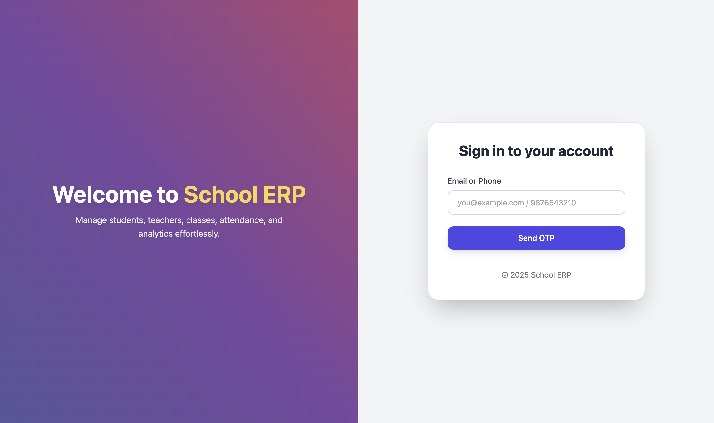

# 🎓 **Swift School – School Management System**

Swift School is an all-in-one, modern, and scalable **School Management System** built to streamline academic and administrative workflows.
It helps institutions digitally manage students, teachers, attendance, exams, communication, finance, and much more—improving efficiency and transparency for **admins, teachers, parents, and students**.

---

## 🚀 **Project Goals**

✔ Simplify daily school operations
✔ Centralize all academic & administrative data
✔ Improve communication across stakeholders
✔ Provide actionable insights with reports & analytics
✔ Deliver a clean, modern, and user-friendly experience
✔ Support scalability for institutions of all sizes

---

# 🖼️ **Screenshots**

### Login



---

# ✨ **Key Features**

| **#** | **Feature**                         | **Description**                                                                    |
| ----- | ----------------------------------- | ---------------------------------------------------------------------------------- |
| 1     | **Student Information Management**  | Store complete student profiles including personal, academic, and contact details. |
| 2     | **Class & Section Management**      | Create classes, assign teachers, and manage schedules with ease.                   |
| 3     | **Attendance Tracking**             | Daily attendance with auto-generated reports.                                      |
| 4     | **Grading & Transcript Management** | Grade entry, automated result calculation, and transcript generation.              |
| 5     | **Teacher Management**              | Manage teacher profiles, workload, and class assignments.                          |
| 6     | **Parent Portal**                   | Give parents access to performance, attendance, and communication.                 |
| 7     | **Communication Module**            | Messaging system for students, teachers, and parents.                              |
| 8     | **Library Management**              | Track books, journals, issue/return logs, and inventory.                           |
| 9     | **Exam & Result Management**        | Create exams, record scores, and generate report cards.                            |
| 10    | **Fee Management**                  | Fee structures, payment tracking, and overdue alerts.                              |
| 11    | **Transportation Management**       | Plan bus routes, assign students, and monitor schedules.                           |
| 12    | **Hostel Management**               | Manage rooms, occupants, and hostel operations.                                    |
| 13    | **Inventory & Asset Control**       | Track school resources and maintenance schedules.                                  |
| 14    | **Role-Based Access Control**       | Secure user roles with admin, teacher, parent, and student permissions.            |
| 15    | **Custom Reports & Analytics**      | Insightful dashboards for better decision-making.                                  |
| 16    | **LMS Integration**                 | Connect with LMS platforms for online learning.                                    |
| 17    | **Mobile App Support**              | Access features from smartphones on the go.                                        |
| 18    | **Data Backup & Recovery**          | Automated backups for data safety.                                                 |
| 19    | **Multi-Language Support**          | Designed for diverse educational environments.                                     |
| 20    | **User-Friendly Interface**         | Clean and intuitive UI for all users.                                              |

---

# ⚙️ **Installation Guide**

## 📌 **Prerequisites**

- Go **1.23+**
- PostgreSQL (or any supported relational DB)
- Docker (optional)
- Configured `.env` file

---

## 🛠️ **Setup Steps**

### 1️⃣ Clone the Repository

```bash
git clone https://github.com/chinmayvivek/SwiftSchool.git
cd SwiftSchool
```

### 2️⃣ Install Dependencies

```bash
go mod tidy
```

### 3️⃣ Configure Environment

Create and update your `.env` file with DB credentials and app configs.

### 4️⃣ Run the Application

```bash
go run main.go
```

---

# 🐳 **Docker Setup (Optional)**

### Build Image

```bash
docker build -t swift-school .
```

### Run Container

```bash
docker run -p 8080:8080 swift-school
```

---

# 📬 **API Documentation**

👉 **[Postman Collection](Swift-School.postman_collection.json)**

---

# 🙌 **About Swift School**

Swift School empowers institutions to go digital by consolidating student data, academic operations, finance, and communication into one powerful platform.
It is designed for **performance, scalability, and ease of use**, making it suitable for institutions of any size.
